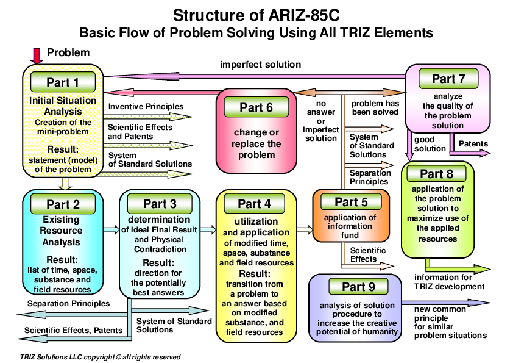
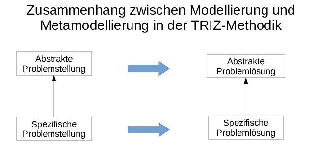

# Anmerkungen zum Seminar am 25.04.2019

## Der ARIZ Problemlöse-Workflow

## Grundlegende Momente der TRIZ-Methodik

Im Mittelpunkt des Vortrags von Dr. Lautenschläger standen wesentliche
Instrumente für die verschiedenen Phasen des ARIZ-Prozesses entsprechend der
TRIZ-Methodologie, wobei die mit den jeweiligen Analyseinstrumenten
verbundenen Konzepte und Begrifflichkeiten in weiteren Seminarterminen noch
genauer herausgearbeitet werden müssen.

Diese Anmerkungen orientieren sich in ihrer Systematik am grundlegenden
TRIZ-Workflow 

## Administrative, technologische und physikalische Probleme

Ausgangspunkt ist die Herausforderung, ein konkretes Problem zu lösen, wozu es
zunächst auf einer sinnvollen Granularitätsstufe zu formulieren ist.  TRIZ
unterscheidet die administrative, die technologische und die physikalische
Granularitätsstufe, wobei das *Ziel* auf der jeweiligen Granularitätsstufe
ist, entweder einen Lösungsplan zu finden oder einen zentralen Widerspruch zu
indetifizieren, der einem solchen Lösungsplan im Wege steht.  Zentrales
Instrument ist die (komkrete) *Modellierung* relevanter Zusammenhänge auf der
entsprechenden Granularitätsebene, die sich an den abstrakten
Problemlösestrategien einer *Meta-Modellierung* nach TRIZ-Standards
orientiert.

Im klassischen TRIZ ist die administrative Ebene meist ausgeblendet, da nur
Probleme betrachtet werden, die bereits auf einem ingenieur-technischen Level
gegeben sind (nur das ist auch patentierbar). ProHEAL verfolgte in dieser
Frage bereits einen weitergehenden Ansatz. In modernen Anwendungen eines "TRIZ
und Business" gewinnen Modellierungen auf Geschäftsprozessebene zunehmend an
Bedeutung, wie dies schon länger auch in der Modellierung von IT-Prozessen im
Kontext eines
[Software-Service-Kodesigns](http://servcase.informatik.uni-leipzig.de/) zu
beobachten ist.

## Teile und Begrifflichkeiten des ARIZ-Prozesses

Die konkrete Granularitätsstufe der Modellierung wird mit dem Begriff des
*Systems* verbunden, mit dem alle *wesentlichen* Aspekte *zielorientiert*
erfasst werden. Dies setzt implizit eine klare Kontextualisierung der
Problemstellung in einer wohldefinierten *Domäne* voraus.  Es kann sinnvoll
sein, hier mit dem *9-Felder-Ansatz* zu arbeiten, wenn die Granularitätstufe
der Modellierung nicht klar ist - besonders dann, wenn eine Remodellierung
nach Rückkehr aus Part 6 erforderlich wird. Die im Seminar kurz aufgeworfene
Frage nach dem verwendeten Systembegriff wäre zu gegebener Zeit noch einmal
aufzugrifen.

Part 1 endet mit dem *Mini-Problem* als genauer Explikation der Zielstellung
aus der Perspektive des Obersystems, die in Part 2 und 3 ggf. weiter zu
detaillieren ist. Ist an dieser Stelle bereits eine zufriedenstellende
Standardlösung aus dem *System der Standardlösungen* greifbar, so kann in
diesem Lösungsprozess bereits zur Umsetzung übergegangen und die TRIZ-Methodik
verlassen werden.

Anderenfalls erfolgt *im Part 2* eine genauere Modellierung der Ressourcen
(*Substanzen* - im Wesentlichen *Entities* im Sinne der ER-Modellierung der
Informatik) und der Beziehungen (*Felder*) zwischen ihnen. Es geht dabei um
die Identifizierung *wesentlicher* Strukturen und Funktionen, wobei die *76
Standards für Stoff-Feld-Modelle* (SF) berücksichtigt werden sollten.  Felder
beschreiben *Wirkungen* von Objekten aufeinander und werden oft durch Verben
beschrieben.  Die Analogie zur RDF-Notation ist augenfällig und wäre zu
gegebener Zeit noch einmal aufzugreifen, allerdings wird in der SF-Notation
deutlich, dass die SF-Ansätze auf die Wirkungsvermittlung zwischen *drei*
Parteien fokussieren, diese hinter dem Verb (= Prädikat in der
RDF-Terminologie) also bereits die relationale *Struktur* adressieren und
damit über die Darstellungsmöglichkeiten einfacher RDF-Graphen hinausgegangen
wird.

Im *Part 3* werden schließlich die Elemente der Modellierung auf ihre
Wesentlichkeit für die gegebene Zielstellung hin abgeklopft und ein
(minimalistisches) *ideales Endresultat* (IER) definiert, das alle für die
Problemlösung wesentlichen Elemente enthält, aber praktisch nicht umsetzbar
sein muss, weil dem eine Reihe von Widersprüchen entgegenstehen. Diese
Problemseparierung in ein IER einerseits und eine Liste von Widersprüchen, die
der Realisierung desselben entgegenstehen, andererseits ist der methodische
Kern von TRIZ als Link zwischen abstrakter Problemstellung und abstrakter
Lösung.

Eine solche methodische Problemaufbereitung weist oft deutlich präziser in die
Richtung, in welcher eine Problemlösung zu suchen ist, als dies etwa einfache
Brainstorming-Ansätze vermögen. Im ProHEAL wird an dieser Stelle der Begriff
der *raffiniert einfachen Lösung* (REL) verwendet, der sich auf eine einfache,
aber für den methodisch nicht geschulten Fachmann nicht offensichtliche
Rekombination von Standardansätzen bezieht, die zur Problemlösung führen.  Wir
haben es hierbei mit dem Phänomen zu tun, dass eine methodische Analyse die
potenziell exponentielle Zahl von Rekombinationsmöglichkeiten so weit
reduzieren kann, dass die Lösung als "Standardlösung" sichtbar wird.  Die
TRIZ-Methodik kann an dieser Stelle ebenfalls verlassen werden, ist aber oft
noch hilfreich, wenn eine solche REL patentiert werden soll.

Anderenfalls konzentrieren sich die Bemühungen im *Teil 4* auf die Auflösung
der identifizierten Widersprüche, indem diese raum-zeitlich und kausal durch
die Bestimmung *kritischer Bereiche* eingegrenzt und separiert werden, bis das
IER in einen Lösungsplan transformiert ist, der sich umsetzen und ausrollen
lässt. Hierbei kommen die *Separationsprinzipien* als Elemente der
Metamodellierung zur Anwendung.

Im Zuge der Widerspruchsbearbeitung kann es sich herausstellen, dass gewisse
Widersprüche sehr hartnäckig sind und auf dem bisher beschrittenen Weg keine
oder nur eine unzureichende Lösung des Problems zu finden ist. Dann ist *im
Teil 6* das Problem zu reformulieren und die Modellierung von vorn zu
iterieren, wobei die bisherigen Erkenntnisse über die genaue Lage der nicht
lösbaren Widersprüche in die Remodellierung eingehen.  Meist ist es daei
erforderlich, die Granularität der Modellierung in einzelnen Teilen zu
verändern.

Im klassischen TRIZ geschieht dies meist durch Übergang von einer
technologischen zu einer der physikalisch-naturgesetzlichen Effekte.  In
neueren Anwendungen wird aber auch der Weg der Problemverallgemeinerung
zunehmend bedeutsam, wenn Probleme nicht (allein) auf der technologischen
Ebene zu lösen sind, sondern den Übergang zur Modellierung komplexerer
Zusammenhänge auf der Ebene administrativer oder sogar gesellschaftlicher
Prozesse erfordern.  Dies übersteigt dann oft auch die
Entscheidungskompetenzen der mit der Problemlösung befassten
gesellschaftlichen Strukturen und lässt sich damit im Kontext eines
klassischen Innovationsprojekts auch nicht mehr behandeln.

## Weiterführende Literatur

* VDI-Norm 4521
* Robert Adunka (2009):
  [Foliensatz](https://www.brainguide.de/upload/publication/e7/24u1n/815a57d16dcb41bb91017185350836d1_1316606331.pdf)
  zu TRIZ Basics
* Karl Koltze, Valeri Souchkov (2010): Systematische Innovation:
  TRIZ-Anwendung in der Produkt- und Prozessentwicklung. München: Hanser.
* Darrell Mann (2009): Hands On Systematic Innovation (Business & Managment).
  IFR Press, 2. Auflage
* Henry Mintzberg, Bruce Ahlstrand, Joseph Lampel (2002): Strategy Safari.
  Eine Reise durch die Wildnis des strategischen Managements. Redline Verlag. 

Hans-Gert Gräbe, 28.04.2019
